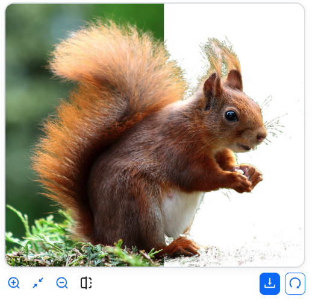

# Ligrila Background Remover



This is a web component that allows users to remove the background from images directly in the browser. It uses the [briaai/RMBG-1.4](https://huggingface.co/briaai/RMBG-1.4) model from Hugging Face for image processing and is built with [Lit](https://lit.dev/).

## Features

- **In-browser background removal:** No need to upload images to a server.
- **Drag-and-drop support:** Easy-to-use interface for selecting images.
- **Zoom and compare:** Tools to inspect the processed image.
- **Customizable:** Can be configured via HTML attributes.
- **Theme support:** Light and dark modes available.
- **Internationalization:** Support for multiple languages.

## Installation

You can install the component using npm or pnpm:

```bash
npm install @ligrila/background-remover
```

```bash
pnpm add @ligrila/background-remover
```

## Usage

To use the component, import it into your JavaScript file and then use it in your HTML:

```javascript
import '@ligrila/background-remover';
```

```html
<background-remover
  data-label="Drag your image here or click to select"
  data-theme="auto"
></background-remover>
```

### Attributes

- `data-model`: The Hugging Face model to use (default: `briaai/RMBG-1.4`).
- `data-show-download`: Whether or not to show the download button (default: `true`).
- `data-theme`: The theme to use (`light`, `dark`, or `auto`; default: `auto`).
- `data-label`: The text to display in the upload area.
- `data-locale`: The language to use (default: the browser's language).

### Events

The component emits the following custom events:

- `@background-remover/model-status`: Fired when the model status changes.
- `@background-remover/model-progress`: Fired while the model is downloading.
- `@background-remover/image-processed`: Fired when an image has been processed.
- `@background-remover/error`: Fired when an error occurs.

## Development

To develop locally, clone the repository and install the dependencies:

```bash
git clone https://github.com/lopezlean/ligrila-background-remover.git
cd ligrila-background-remover
pnpm install
```

Then, you can start the development server:

```bash
pnpm run dev
```

### Scripts

- `pnpm run dev`: Starts the Vite development server.
- `pnpm run build`: Builds the component for production.
- `pnpm run preview`: Previews the production build.
- `pnpm run lint:eslint`: Lints the code for errors.

## Contributions

Contributions are welcome. Please open an issue or a pull request to discuss changes.

## License

This project is under the [MIT](LICENSE) license.